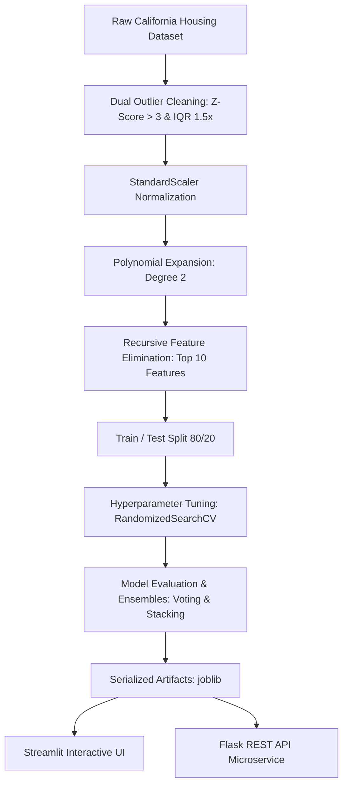

# 🏡 California Housing Valuation Intelligence
### End-to-End Machine Learning Pipeline & Interactive Valuation System

[](https://www.python.org/)
[](https://scikit-learn.org/)
[](https://xgboost.readthedocs.io/)
[](https://streamlit.io/)
[](https://www.redfin.com/news/data-center/)
[](https://opensource.org/licenses/MIT)
[](https://www.unt.edu/)

A production-grade machine learning repository predicting California median house values (`MedHouseVal`). This system combines rigorous outlier filtering, 2nd-degree polynomial interaction feature engineering, Recursive Feature Elimination (RFE), and hyperparameter-tuned ensemble models (**XGBoost** and **Stacking Regressor** achieving **$R^2 \approx 0.825$**), served through an interactive **Streamlit web application** and a **Flask REST API**.

---

## 📌 Table of Contents
- [Project Overview](#-project-overview)
- [Key Architectural Highlights](#-key-architectural-highlights)
- [Model Benchmark Leaderboard](#-model-benchmark-leaderboard)
- [Machine Learning Workflow](#-machine-learning-workflow)
- [Interactive Web Application](#-interactive-web-application)
- [Project Structure](#-project-structure)
- [Quickstart Guide](#-quickstart-guide)
- [API Documentation](#-api-documentation)
- [Academic Context & Authors](#-academic-context--authors)

---

## 📖 Project Overview

California housing prices present significant non-linear dynamics driven by geographical clusters, household income, and density. This project systematically evaluates **10 distinct regression paradigms** to derive high-accuracy valuations while maintaining model interpretability.



---

## ⚡ Key Architectural Highlights

1. **Dual Outlier Detection & Purification**:
   - Filtered out anomalous block groups using combined **Z-Score ($> 3.0$)** and **Interquartile Range ($1.5 \times \text{IQR}$)** thresholds.
   - Purged 3,798 distorted observations (18.4%), significantly improving model stability and generalization.

2. **Polynomial Spatial Interactions & RFE**:
   - Standard linear models fail to capture micro-location premiums. We expanded normalized features using **PolynomialFeatures(degree=2)** into 44 interaction terms.
   - Applied **Recursive Feature Elimination (RFE)** with Linear Regression to isolate the top 10 most predictive spatial interaction terms:
     - `MedInc`, `AveOccup`, `Latitude`, `Longitude`
     - `MedInc * Latitude` & `MedInc * Longitude` (High-income coastal hubs)
     - `HouseAge * Latitude` & `HouseAge * Longitude` (Historic urban centers vs suburban growth)
     - `AveRooms * Latitude` & `AveRooms * Longitude` (Regional dwelling footprints)

3. **Multi-Model Benchmark & Ensembles**:
   - Evaluated 10 distinct models: Linear Regression, Lasso, Decision Tree (Default & GridSearch), Random Forest (Default & RandomizedSearch), XGBoost (Default & RandomizedSearch), Voting Regressor, and Stacking Regressor.
   - **Tuned XGBoost** and **Stacking Regressor** tied as top performers with **$R^2 = 0.8248$** and an **RMSE of $0.4470$** ($\approx \$44,700$ error margin).

---

## 🏆 Model Benchmark Leaderboard

Ranked by generalization capability on the unseen test dataset ($N = 3,369$):

| Rank | Model | Test $R^2$ | Test RMSE | Test MAE | Train $R^2$ | Fit Time | Status |
|:---:|:---|:---:|:---:|:---:|:---:|:---:|:---:|
| 🥇 | **XGBoost with Random Search** | **0.8248** | **0.4470** | **0.2932** | 0.9538 | 1.19s | **Best Overall Model** |
| 🥈 | **Stacking Regressor (Meta-Learner)** | **0.8246** | **0.4473** | **0.2920** | 0.9677 | 40.46s | **Top Ensemble** |
| 🥉 | **XGBoost Regressor (Baseline)** | 0.8195 | 0.4537 | 0.3015 | 0.9447 | 0.46s | Fast Baseline |
| 4 | Voting Regressor (DT + RF + XGB) | 0.8051 | 0.4715 | 0.3066 | 0.9602 | 11.10s | Ensemble Average |
| 5 | Random Forest with Random Search | 0.7966 | 0.4816 | 0.3164 | 0.9954 | 4.33s | Tuned Bagging |
| 6 | Random Forest Regressor | 0.7898 | 0.4896 | 0.3190 | 0.9731 | 3.12s | Bagging Baseline |
| 7 | Decision Tree with Grid Search | 0.7123 | 0.5728 | 0.3743 | 0.8577 | 0.11s | Tuned Tree |
| 8 | Linear Regression | 0.6306 | 0.6491 | 0.4795 | 0.6454 | 0.01s | Parametric Baseline |
| 9 | Decision Tree Regressor | 0.5832 | 0.6895 | 0.4353 | 1.0000 | 0.18s | Prone to Overfitting |
| 10 | Lasso Regression ($L_1$) | 0.4615 | 0.7837 | 0.5952 | 0.4712 | 0.01s | High Sparsity |

---

## 📊 Visual Evaluation

### 1. Benchmark Comparison Chart
Comparison of Test $R^2$ score and Test Root Mean Squared Error (RMSE) across all candidate models:


### 2. Predicted vs. Actual Values
Scatter plot showing prediction fidelity along the 45-degree diagonal line of perfect fit for the tuned XGBoost model:


### 3. Feature Correlation Matrix
Cross-correlation between raw California census features and the target median house value:


---

## 💻 Interactive Web Application

The project features a full-fledged, multi-page **Streamlit Web Application** and a **Flask REST API & Dashboard** designed for interactive exploration and stakeholder demonstrations.

### Features:
- 🎛️ **Live Valuation Estimator**: Interactive sliders for block features (No. of Bedrooms in House, No. of Rooms, No. of Occupants, Median Income, etc.) with tooltips.
- 📍 **California Regional Presets**: Instant 1-click loading of iconic California micro-markets:
  - *Silicon Valley (Palo Alto)*
  - *San Francisco Bay Area Coastal*
  - *Los Angeles Coastal (Santa Monica)*
  - *Central Valley (Fresno Affordable)*
- 🗺️ **Interactive Geographic Map**: Real-time pin rendered at the selected Latitude/Longitude coordinates.
- 📈 **Redfin Data Center Real Market Integration**: Compares ML block valuations against live transaction metrics streamed directly from the official **Redfin Data Center** (2012–2026):
  - County median sale prices (e.g. \$1.7M in Santa Clara, \$1.66M in SF, \$940k in LA)
  - Price per square foot (PPSF), Days on Market (DOM), and Sale-to-List ratios.
  - Interactive county historical trend charts across single family, condos, and townhouses.
- 📊 **Leaderboard & CSV Export**: Download full model benchmark summaries directly from the UI.

---

## 📁 Project Structure

```text
california-housing-ml/
│
├── .gitignore                      # Python, Jupyter, cache & OS ignore rules
├── LICENSE                         # MIT License
├── README.md                       # Comprehensive GitHub repository documentation
├── requirements.txt                # Pinned production dependencies
├── run_pipeline.py                 # Unified CLI runner (train, app, api, redfin, predict)
│
├── app/                            # Web Applications
│   ├── app.py                      # Streamlit interactive application
│   └── web_server.py               # Flask REST API & Tailwind dashboard
│
├── src/                            # Modular Machine Learning Package
│   ├── __init__.py
│   ├── data_loader.py              # California Housing ingestion & metadata
│   ├── preprocessor.py             # Outlier filter, StandardScaler, Poly deg=2, RFE
│   ├── models.py                   # Model registry & hyperparameter search grids
│   ├── evaluate.py                 # Metrics computation & high-res plotting
│   ├── train.py                    # End-to-end training, benchmarking & serialization
│   ├── predict.py                  # Real-time inference engine
│   └── redfin_loader.py            # Redfin Data Center streaming & market analytics
│
├── data/                           # Real-World Market Data (Redfin Data Center)
│   ├── redfin_california_state.csv # State-level monthly time-series (2012-2026)
│   └── redfin_california_counties.csv # County-level metrics across all CA counties
│
├── notebooks/                      # Jupyter Notebooks
│   ├── california_housing_eda_and_modeling.ipynb  # Documented analysis & experiments
│   └── legacy/
│       └── project_V1-0.ipynb      # Preserved original experimental notebook
│
├── models/                         # Serialized Production Artifacts
│   ├── preprocessor_pipeline.joblib# Fitted Scaler + Poly + RFE pipeline
│   ├── best_xgboost_model.joblib   # Serialized Tuned XGBoost Regressor
│   ├── stacking_model.joblib       # Serialized Stacking Regressor
│   ├── metrics_summary.csv         # Leaderboard metrics table
│   └── metrics_summary.json        # Machine-readable evaluation output
│
└── reports/                        # Documentation & Visuals
    ├── ML_FinalProject_Report.pdf  # UNT CSCE 5215 Academic Report
    └── figures/                    # High-res generated figures
        ├── model_performance_comparison.png
        ├── predicted_vs_actual.png
        └── feature_correlation_matrix.png
```

---

## 🚀 Quickstart Guide

### 1. Clone & Install Dependencies
```bash
# Clone the repository
git clone https://github.com/your-username/california-housing-ml.git
cd california-housing-ml

# Create and activate virtual environment (optional but recommended)
python -m venv venv
venv\Scripts\activate      # Windows
# source venv/bin/activate  # macOS/Linux

# Install requirements
pip install -r requirements.txt
```

### 2. Run the Interactive Streamlit UI
```bash
python run_pipeline.py --app
# Or directly via streamlit:
streamlit run app/app.py
```
*The app will automatically launch in your default browser at `http://localhost:8501`.*

### 3. Run the Flask REST API & Web Dashboard
```bash
python run_pipeline.py --api
# Access dashboard at http://127.0.0.1:5000
```

### 4. Update Real-World Market Data (Redfin Data Center)
```bash
python run_pipeline.py --redfin
```

### 5. Retrain the Pipeline & Regenerate Figures
```bash
python run_pipeline.py --train
```

### 6. CLI Inference Test
```bash
python run_pipeline.py --predict
```

---

## 🔌 API Documentation

The lightweight Flask microservice (`app/web_server.py`) provides REST endpoints for automated integration.

### `POST /api/predict`
Calculate house valuation from raw block features.

**Sample Request:**
```bash
curl -X POST http://127.0.0.1:5000/api/predict \
  -H "Content-Type: application/json" \
  -d '{
    "MedInc": 8.32,
    "HouseAge": 41.0,
    "AveRooms": 6.98,
    "AveBedrms": 1.02,
    "Population": 322.0,
    "AveOccup": 2.55,
    "Latitude": 37.88,
    "Longitude": -122.23,
    "model": "XGBoost"
  }'
```

**Sample Response:**
```json
{
  "status": "success",
  "data": {
    "model_used": "Tuned XGBoost Regressor",
    "prediction_raw": 4.1202,
    "estimated_price_usd": 412015,
    "estimated_price_formatted": "$412,015",
    "confidence_range_usd": [367155, 456875],
    "confidence_range_formatted": "$367,155 - $456,875",
    "transformed_features": {
      "MedInc": 3.011,
      "AveOccup": -0.402,
      "Latitude": 1.036,
      "Longitude": -1.328,
      "MedInc Latitude": 3.119,
      "MedInc Longitude": -4.001,
      "HouseAge Latitude": 1.012,
      "HouseAge Longitude": -1.298,
      "AveRooms Latitude": 1.488,
      "AveRooms Longitude": -1.908
    },
    "redfin_comparison": {
      "county": "Santa Clara County",
      "redfin_median_sale_price_formatted": "$1,700,000",
      "redfin_ppsf": "$985/sqft",
      "redfin_median_dom": "13 days",
      "sale_to_list_ratio": "104.0%"
    }
  }
}
```

### `GET /api/redfin/counties`
Retrieve live California county housing market data from the Redfin Data Center.

**Sample Request:**
```bash
curl http://127.0.0.1:5000/api/redfin/counties
```

---

## 🎓 Academic Context & Authors

- **Course**: CSCE 5215: Machine Learning
- **Department**: Department of Computer Science and Engineering
- **University**: University of North Texas (UNT)
- **Author**: Sampath Naga Maddineni
- **Academic Paper**: Refer to [`reports/ML_FinalProject_Report.pdf`](reports/ML_FinalProject_Report.pdf) for the comprehensive technical paper.

---

## 📄 License

This project is licensed under the MIT License — see the [LICENSE](LICENSE) file for details.
